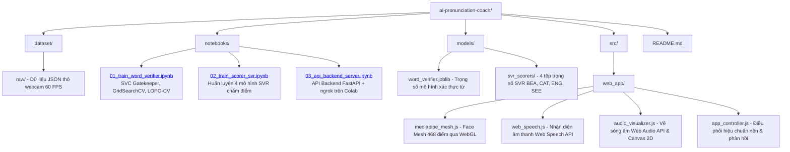

# 🎙️ LipSync-AI: Phân Tích Khẩu Hình Miệng Đột Phá Bằng Computer Vision & AI

---

> **Dự án Nghiên cứu Khoa học Kỹ thuật dành cho Học sinh Trung học (Năm học 2026 - 2027)**
> **Đơn vị thực hiện:** Trường THPT Chuyên Trần Đại Nghĩa – Sở GD&ĐT Thành phố Hồ Chí Minh
> **Lĩnh vực:** Hệ thống Thông minh & Trí tuệ Nhân tạo (AI & Computer Vision)

---

## 🔗 Liên Kết Trực Tiếp (Quick Links)

* 🌐 **Ứng dụng Trực tuyến (Web App):** [AI Pronunciation Coach Live](https://ai-pronunciation-coach-1.ai.studio)
* 📄 **Báo cáo Nghiên cứu Đầy đủ:** [Google Docs Paper](https://docs.google.com/document/d/13C2cDjt97nKfiUpA4NZNeaOwAfjWiCY-iIAVs6xPHsI/edit?tab=t.0)
* 🚀 **API Server (Google Colab):** [](https://www.google.com/search?q=%5Bhttps%3A%2F%2Fcolab.research.google.com%2Fdrive%2F1a4C0yXKm2rUPm4Eol4fYIfiFr0EgZ5vO%3Fusp%3Dsharing%5D%28https%3A%2F%2Fcolab.research.google.com%2Fdrive%2F1a4C0yXKm2rUPm4Eol4fYIfiFr0EgZ5vO%3Fusp%3Dsharing%29)
* 🧠 **Train Model 1 - Word Verifier (Colab):** [](https://colab.research.google.com/drive/1B9KyYYVlKAXrahF_-39qpHiwusGbMfOg?usp=sharing)
* 🎯 **Train Model 2 - Pronunciation Scorer (Colab):** [](https://colab.research.google.com/drive/10hVWjmp2OpwF4sEcTzONqCs-F5CZpyTJ?usp=sharing)

---

## 📌 1. Tên Đề Tài & Giới Thiệu Chung

* **Tên đề tài chính thức:** *Xây dựng nền tảng web tích hợp trí tuệ nhân tạo hỗ trợ đánh giá và cải thiện phát âm tiếng Anh thông qua phân tích khẩu hình miệng.*
* **Tên tóm tắt:** *Dùng Computer Vision và AI phân tích khẩu hình miệng để cải thiện phát âm cho người Việt.*

### Vấn đề giải quyết

Phần lớn các giải pháp luyện phát âm hiện nay (Duolingo, Elsa Speak,...) phụ thuộc vào mô hình nhận dạng giọng nói (ASR/Speech-to-Text), chỉ trả về kết quả đúng/sai về mặt âm thanh mà không chỉ ra nguyên nhân vật lý cốt lõi: **sự sai lệch trong cấu hình mở cơ môi, hàm và khoang miệng**. Người học Việt Nam thường gặp khó khăn nghiêm trọng ở các nguyên âm khó (`/uː/`, `/æ/`, `/iː/`, `/ɪ/`) do thói quen phát âm tiếng mẹ đẻ.

### Phương pháp tiếp cận

Dự án đề xuất giải pháp đa phương thức (*Multimodal Feedback*):

1. **Xử lý thị giác tại biên (Edge AI):** Khai thác Google MediaPipe Face Mesh V2 chạy trên nền WebGL để bắt 468 điểm mốc khuôn mặt với độ trễ thấp ($12 - 22\text{ ms}$) mà không cần gửi video về máy chủ.
2. **Chuẩn hóa không gian & động học:** Chuẩn hóa tọa độ theo khoảng cách 2 khóe mắt (IOD) và xây dựng vector đặc trưng 62 chiều bao gồm các thống kê chuỗi thời gian, vận tốc cơ môi và tỉ lệ co giãn.
3. **Kiến trúc ML 2 giai đoạn (Two-Stage Pipeline):**
* *Giai đoạn 1 (Word Verifier - Gatekeeper):* Mô hình SVC (RBF Kernel) phân loại 4 lớp từ để phát hiện trường hợp phát âm sai từ hoặc khẩu hình lệch hướng trước khi cho phép chấm điểm.
* *Giai đoạn 2 (Pronunciation Scorer):* Hệ thống 4 mô hình SVR độc lập chấm điểm độ tương đồng khẩu hình trên thang 60–100.


---

## 📁 2. Cấu Trúc Thư Mục (Directory Tree)



---

## 📊 3. Dữ Liệu & Quy Trình Xử Lý (Data & Preprocessing)

### Dữ liệu thực nghiệm

* **Quy mô:** Thu thập từ 63 đối tượng tại TP. Hồ Chí Minh (chủ yếu từ 14–17 tuổi), loại bỏ 3 mẫu lỗi kỹ thuật $\rightarrow$ Bộ dữ liệu chuẩn gồm **60 người (247 bản ghi hoàn chỉnh)**.
* **4 Từ vựng mục tiêu đại diện cho các nhóm khẩu hình:**
* `Beautiful` (/uː/ - chu tròn môi, formant 2 thấp)
* `Cat` (/æ/ - mở rộng cơ hàm theo chiều dọc, formant 1 cao)
* `English` (/ɪ/ - mở tự nhiên vừa phải)
* `See` (/iː/ - kéo căng môi theo chiều ngang)


### Pipeline trích xuất 62 đặc trưng

1. **Lọc trung vị (`scipy.signal.medfilt`):** Triệt tiêu hiện tượng nhảy khung hình do phần cứng webcam.
2. **Chuẩn hóa tĩnh cá nhân:** Tọa độ chiều cao ($H$) và chiều rộng ($W$) của môi được chia cho khoảng cách hai khóe mắt (Mốc 33 & 263) và kích thước môi trạng thái nghỉ ($H_{\text{static}}, W_{\text{static}}$).
3. **Động học 4 kênh:** Trích xuất 4 kênh dữ liệu gồm $[H_{\text{norm}}, W_{\text{norm}}, \text{Velocity } \sqrt{\Delta H^2 + \Delta W^2}, \text{Aspect Ratio } \frac{H}{W}]$.
4. **Vector 62 chiều:** Mỗi kênh trích xuất 10 đặc trưng thống kê ($4 \times 10 = 40$) $+$ Nội suy tuyến tính 8 điểm cố định cho $H$ và $W$ ($2 \times 8 = 16$) $+$ 4 đặc trưng cực trị/tỉ lệ co giãn tĩnh $+$ cờ góc nghiêng ($1$) $+$ độ dài thực ($1$) $\rightarrow$ **Tổng cộng đúng 62 đặc trưng/mẫu**.

---

## ⚙️ 4. Cài Đặt Môi Trường (Installation)

### Yêu cầu tiên quyết

* Python version `>= 3.10`
* Trình duyệt: Google Chrome / Microsoft Edge hỗ trợ WebGL và Web Speech API.
* Thiết bị phần cứng: Camera tối thiểu 720p @ 30–60 FPS, Microphone tiêu chuẩn.

### Cài đặt thư viện phụ thuộc

```bash
git clone https://github.com/your-username/ai-pronunciation-coach.git
cd ai-pronunciation-coach

pip install numpy==1.24.3 \
            scipy==1.11.1 \
            scikit-learn==1.3.0 \
            joblib==1.3.2 \
            fastapi==0.103.0 \
            uvicorn==0.23.2 \
            pyngrok==7.0.0

```

---

## 🚀 5. Hướng Dẫn Vận Hành Hệ Thống (Usage)

### Bước 1: Huấn luyện mô hình (Google Colab)

* Chạy Notebook **[Train Model 1 (Word Verifier)](https://colab.research.google.com/drive/1B9KyYYVlKAXrahF_-39qpHiwusGbMfOg?usp=sharing)** để tối ưu siêu tham số SVM bằng `GridSearchCV` kết hợp `GroupKFold` và xuất tệp `word_verifier.joblib`.
* Chạy Notebook **[Train Model 2 (Pronunciation Scorer)](https://colab.research.google.com/drive/10hVWjmp2OpwF4sEcTzONqCs-F5CZpyTJ?usp=sharing)** để huấn luyện 4 mô hình SVR chấm điểm khẩu hình.

### Bước 2: Kích hoạt Backend API

* Mở Notebook **[API Server Colab](https://colab.research.google.com/drive/1a4C0yXKm2rUPm4Eol4fYIfiFr0EgZ5vO?usp=sharing)** và chạy toàn bộ các cell để khởi chạy FastAPI Server thông qua đường hầm Ngrok.
* Sao chép đường dẫn API public dạng: `[https://xxxx-xx-xx.ngrok-free.app](https://xxxx-xx-xx.ngrok-free.app)`.

### Bước 3: Trải nghiệm ứng dụng Web Frontend

1. Truy cập trực tiếp tại: **[AI Pronunciation Coach App](https://ai-pronunciation-coach-1.ai.studio)**
2. Cấp quyền truy cập Camera và Microphone trên trình duyệt.
3. **Hiệu chuẩn (Calibration):** Giữ thẳng mặt trước camera trong 3 giây ở trạng thái nghỉ để hệ thống đo mốc môi nền.
4. **Luyện tập tương tác (Practice Studio):**
* Chọn từ cần luyện và quan sát video chuyển động môi mẫu của người bản xứ.
* Nhấn nút **"Nói Từ Này"**: Hệ thống ghi nhận luồng âm thanh và phân tích chuỗi quỹ đạo môi theo thời gian thực.
* **Phản hồi tức thì:**
* ❌ **Phát âm sai/Lệch khẩu hình:** Viền môi hiển thị màu **Đỏ**, biểu tượng cảnh báo và từ chối chấm điểm.
* ✅ **Phát âm chuẩn:** Viền môi chuyển màu **Xanh lục**, hiển thị điểm số trên thang 60–100 kèm nhận xét chi tiết về độ mở và độ căng cơ môi.


---

## 📈 6. Kết Quả Nghiên Cứu & Thảo Luận (Results)

### 6.1. So sánh hiệu năng giữa các kiến trúc

| Kiến trúc thử nghiệm | Kiểu dữ liệu | Số tham số | LOPO-CV Performance | Hiện tượng & Nhận xét |
| --- | --- | --- | --- | --- |
| **SOTA Transformer** | Chuỗi thô | ~128.000 | LOPO-MAE: $5.54 \pm 11.89$ | Overfit nặng do dữ liệu nhỏ ($N=244$), mất khả năng tổng quát hóa trên người dùng mới. |
| **2D-CNN + BiGRU + Attention** | Chuỗi thô | ~147.000 | Val Loss: $0.8 \rightarrow 5.7$ | Overfit nghiêm trọng, checkpoint dao động mạnh. |
| **Random Forest** | 62 đặc trưng | 62 chiều | LOPO Acc: $74.2\%$ | Hoạt động tốt nhưng khả năng phân tách biên kém hơn SVM. |
| **SVC (RBF Kernel) — Lựa chọn** | 62 đặc trưng | **62 chiều** | **LOPO Acc: 76.6% (Train: 76.7%)** | **Tối ưu nhất:** LOPO-CV và CV nội bộ chênh lệch chỉ $0.1\%$, hoàn toàn triệt tiêu overfit. |

### 6.2. Ma trận nhầm lẫn của Word Verifier (LOPO-CV trên 247 mẫu)

| Thực tế \ Dự đoán | Beautiful | Cat | English | See | Tỷ lệ chính xác (%) |
| --- | --- | --- | --- | --- | --- |
| **Beautiful** | **52** | 4 | 5 | 0 | **85.2%** |
| **Cat** | 5 | **47** | 3 | 6 | **77%** |
| **English** | 2 | 5 | **46** | 8 | **75.4%** |
| **See** | 3 | 5 | 11 | **48** | **68.9%** |

### 6.3. Hiệu năng kỹ thuật của sản phẩm Web

| Tiêu chí kỹ thuật | Kết quả đo lường | Ghi chú & Đánh giá |
| --- | --- | --- |
| **Độ trễ suy luận (Latency)** | **12 – 22 ms** | Xử lý hoàn toàn tại Client bằng WebGL, không phụ thuộc đường truyền mạng. |
| **Tốc độ khung hình (FPS)** | **55 – 60 FPS** | Đảm bảo độ mượt mà trên các thiết bị laptop/smartphone phổ thông. |
| **Dung lượng tải trang** | **< 8.5 MB** | Tối ưu hóa nhờ tải mô hình tĩnh và CDN WebAssembly. |
| **Tỷ lệ nhận diện Landmark** | **99.1%** | Nhận diện chính xác và ổn định trong điều kiện ánh sáng tiêu chuẩn. |

---

## 👥 7. Tác Giả & Đơn Vị Công Tác

* **Học sinh nghiên cứu:**
* **Nguyễn Đăng Minh** (Lớp 11CA5 – Trường THPT Chuyên Trần Đại Nghĩa, TP.HCM)
* **Nguyễn Đỗ Lan Nhi** (Lớp 11CA5 – Trường THPT Chuyên Trần Đại Nghĩa, TP.HCM)


* **Giáo viên hướng dẫn:** Thầy **Trần Lê Hùng Phi**
* **Đơn vị công tác:** Trường THPT Chuyên Trần Đại Nghĩa, Sở Giáo dục và Đào tạo Thành phố Hồ Chí Minh.

---

## 📝 8. Trích Dẫn (Citation)

Nếu bạn sử dụng mã nguồn, kiến trúc pipeline hoặc dữ liệu nghiên cứu này, vui lòng trích dẫn theo định dạng:

```bibtex
@article{NguyenTran2026LipSyncAI,
  author    = {Nguyễn Đăng Minh and Nguyễn Đỗ Lan Nhi and Trần Lê Hùng Phi},
  title     = {Dùng Computer Vision và AI Phân Tích Khẩu Hình Miệng Để Cải Thiện Phát Âm Cho Người Việt},
  journal   = {Cuộc thi Học sinh Nghiên cứu Khoa học - Năm học 2026-2027},
  school    = {Trường THPT Chuyên Trần Đại Nghĩa},
  address   = {Thành phố Hồ Chí Minh, Việt Nam},
  year      = {2026},
  month     = {Tháng 9}
}

```
